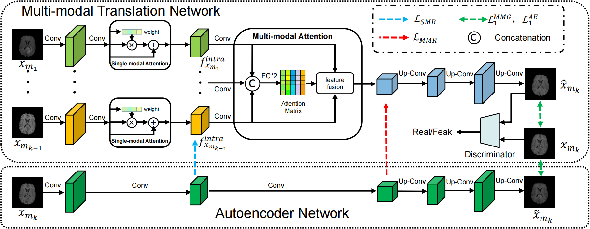
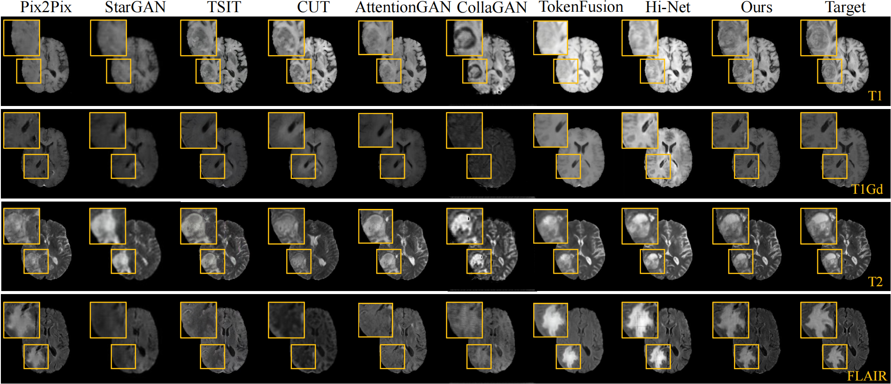
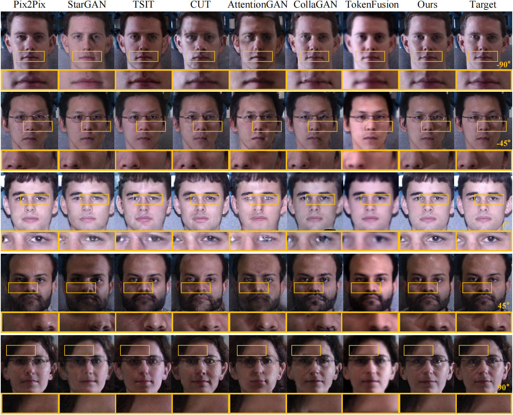
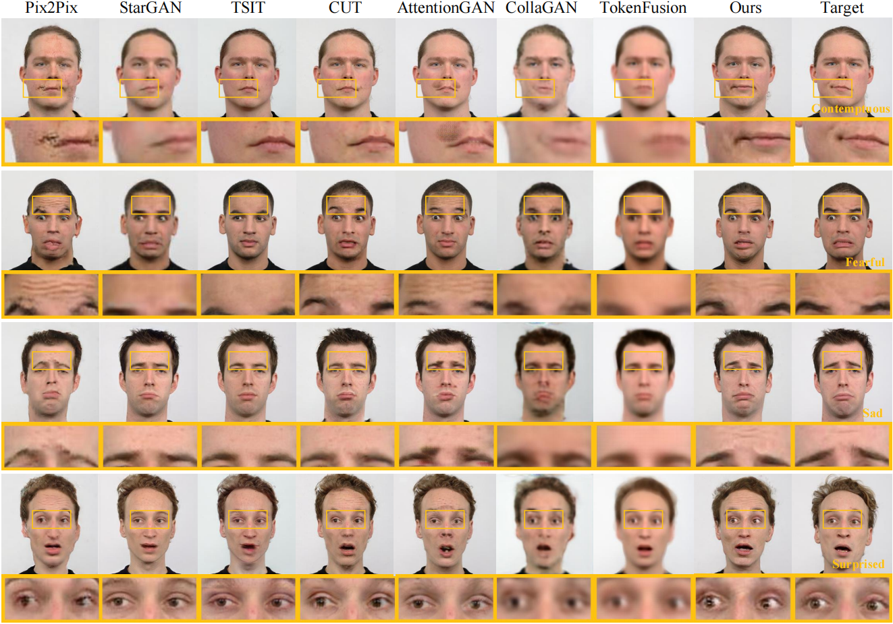

# ACA-GAN: Autoencoder-based Collaborative Attention GAN for Multi-modal Image Synthesis

The Pytorch implements of our ACA-GAN: Autoencoder-based Collaborative Attention GAN for Multi-modal Image Synthesis. **All the source code will be available.**

**The overview of our ACA-GAN framework.**


## Comparsion with State-of-the-Art Methods
### BraTS2020


### Multi-PIE


### RaFD


## Environment
```
python              3.7.12
pytorch             1.12.1
torchvision         0.13.0
tqdm                4.64.1
numpy               1.21.6
SimpleITK           2.1.1.1
opencv-python       4.6.0.66
easydict            1.9
tensorboard         2.11.0
Pillow              9.2.0
```
## Prepare datasets
Download the datasets from the official way and rearrange the files to the following structure.
### BraTS2020
```
BraTS2020
├── MICCAI_BraTS2020_TrainingData
│   ├── flair
│       ├── BraTS20_Training_001_flair.nii.gz
│       ├── BraTS20_Training_002_flair.nii.gz
│       ├── BraTS20_Training_003_flair.nii.gz
│       ├── ...
│   ├── t1
│       ├── BraTS20_Training_001_t1.nii.gz
│       ├── BraTS20_Training_002_t1.nii.gz
│       ├── BraTS20_Training_003_t1.nii.gz
│       ├── ...
│   ├── t1ce
│       ├── BraTS20_Training_001_t1ce.nii.gz
│       ├── BraTS20_Training_002_t1ce.nii.gz
│       ├── BraTS20_Training_003_t1ce.nii.gz
│       ├── ...
│   ├── t2
│       ├── BraTS20_Training_001_t2.nii.gz
│       ├── BraTS20_Training_002_t2.nii.gz
│       ├── BraTS20_Training_003_t2.nii.gz
│       ├── ...
├── MICCAI_BraTS2020_ValidationData
│   ├── ...
```
### Multi-PIE
```
MultiPIE
├── MultiPIE_TrainingData
│   ├── front
│       ├── MultiPIE_front_001.png
│       ├── MultiPIE_front_002.png
│       ├── MultiPIE_front_003.png
│       ├── ...
│   ├── l45
│       ├── MultiPIE_l45_001.png
│       ├── MultiPIE_l45_002.png
│       ├── MultiPIE_l45_003.png
│       ├── ...
│   ├── l90
│       ├── MultiPIE_l90_001.png
│       ├── MultiPIE_l90_002.png
│       ├── MultiPIE_l90_003.png
│       ├── ...
│   ├── r45
│       ├── MultiPIE_r45_001.png
│       ├── MultiPIE_r45_002.png
│       ├── MultiPIE_r45_003.png
│       ├── ...
│   ├── r90
│       ├── MultiPIE_r90_001.png
│       ├── MultiPIE_r90_002.png
│       ├── MultiPIE_r90_003.png
│       ├── ...
├── MultiPIE_ValidationData
│   ├── ...
```
### RaFD
```
RaFD090Crop
├── Rafd090_01_Caucasian_female_angry_frontal.jpg
├── Rafd090_01_Caucasian_female_angry_left.jpg
├── Rafd090_01_Caucasian_female_angry_right.jpg
├── Rafd090_01_Caucasian_female_contemptuous_frontal.jpg
├── Rafd090_01_Caucasian_female_contemptuous_left.jpg
├── Rafd090_01_Caucasian_female_contemptuous_right.jpg
├── Rafd090_01_Caucasian_female_disgusted_frontal.jpg
├── Rafd090_01_Caucasian_female_disgusted_left.jpg
├── Rafd090_01_Caucasian_female_disgusted_right.jpg
├── Rafd090_01_Caucasian_female_fearful_frontal.jpg
├── Rafd090_01_Caucasian_female_fearful_left.jpg
├── Rafd090_01_Caucasian_female_fearful_right.jpg
├── Rafd090_01_Caucasian_female_happy_frontal.jpg
├── Rafd090_01_Caucasian_female_happy_left.jpg
├── Rafd090_01_Caucasian_female_happy_right.jpg
├── Rafd090_01_Caucasian_female_neutral_frontal.jpg
├── Rafd090_01_Caucasian_female_neutral_left.jpg
├── Rafd090_01_Caucasian_female_neutral_right.jpg
├── Rafd090_01_Caucasian_female_sad_frontal.jpg
├── Rafd090_01_Caucasian_female_sad_left.jpg
├── Rafd090_01_Caucasian_female_sad_right.jpg
├── Rafd090_01_Caucasian_female_surprised_frontal.jpg
├── Rafd090_01_Caucasian_female_surprised_left.jpg
├── Rafd090_01_Caucasian_female_surprised_right.jpg
├── Rafd090_02_Caucasian_female_angry_frontal.jpg
├── ...
```
## Train
Edit the .yaml file of the corresponding dataset for training configuration and run the following command to train.
```
python train.py options/brats/collaborative_attention.yaml
```

## Test
Edit the .yaml file of the corresponding dataset for testing configuration and run the following command to test.
```
python test.py options/brats/collaborative_attention.yaml
```
